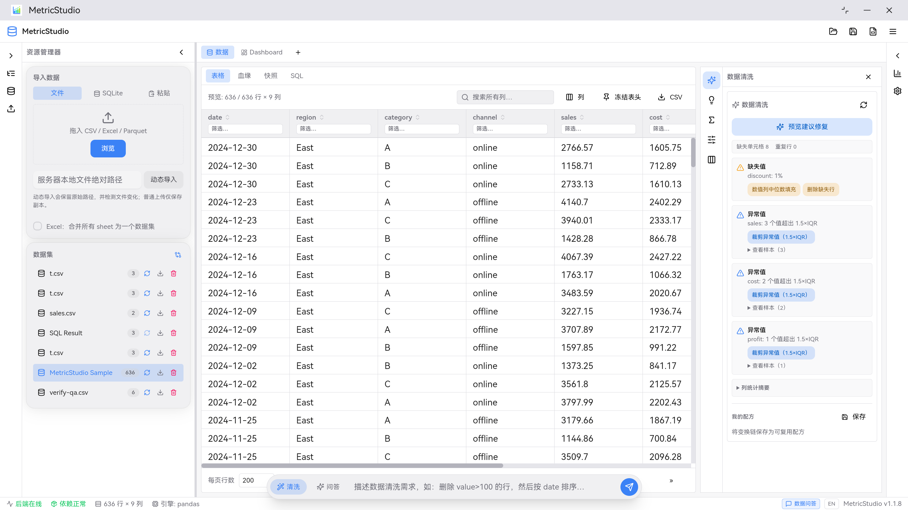
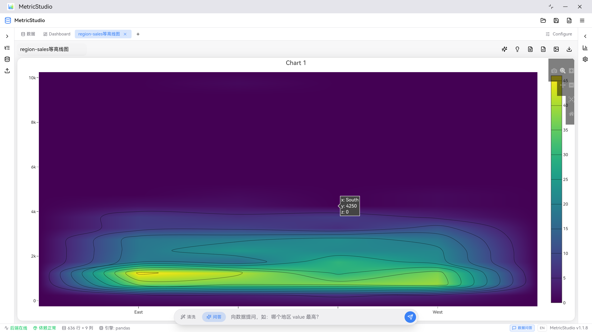
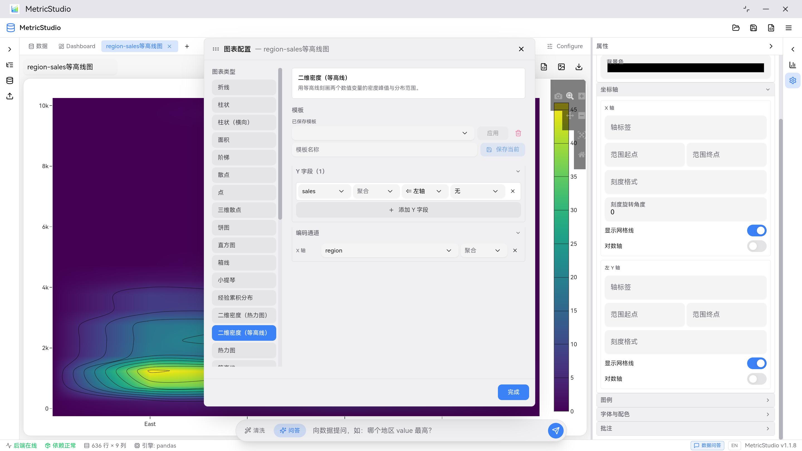
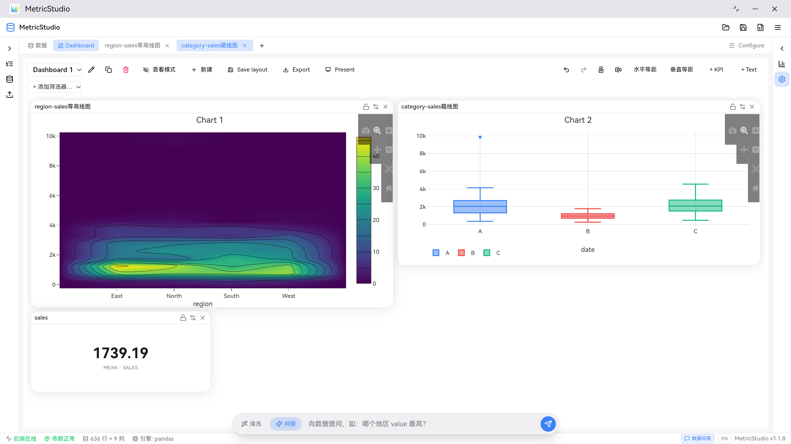
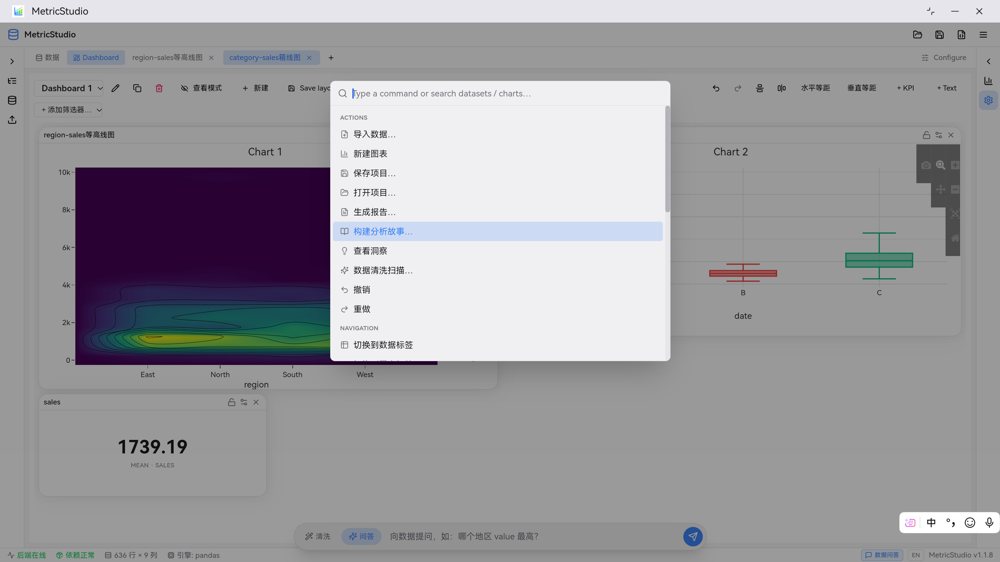
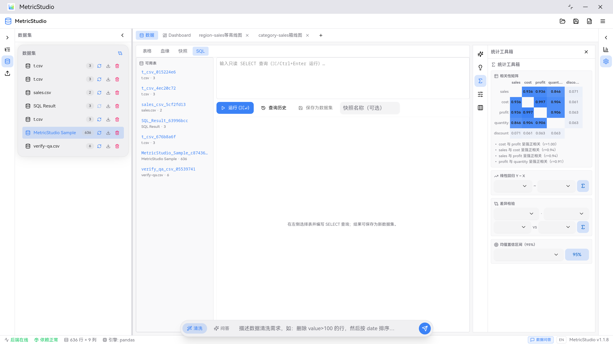

# MetricStudio

[English](README.en.md) | 简体中文

基于 Plotly 的个人数据分析桌面工具。导入数据后即可完成清洗变换、可视化图表构建、交互式 Dashboard 编排，并借助 AI 完成数据问答、洞察叙述与统计解释——全程数据留在本机。

当前版本：**1.2.0**

## 界面预览

| 数据表与质量中心 | 可视化图表 |
|---|---|
|  |  |
| **拖拽式图表配置** | **Dashboard 编排** |
|  |  |
| **命令面板** | **SQL 工作台** |
|  |  |

## 功能特性

### 数据管理
- 多格式导入：CSV / Excel（多 Sheet 合并或分表）/ Parquet / JSON（含 NDJSON）/ SQLite 表 / 粘贴文本
- 不可变数据快照：物化任意变换步骤，支持快照对比（diff）与恢复为新数据集
- 变换链：筛选 / 排序 / 透视 / 连接 / 计算列 / 字符串清理等 16 类操作，支持中间步骤预览、步骤级启用/禁用、全局撤销重做
- 数据源自动刷新：轮询源文件变更并重放变换链，失败保留上一可用版本，数据集带版本标记
- SQL 工作台：跨数据集只读 SELECT、`EXPLAIN QUERY PLAN` 执行计划、会话内查询历史、结果一键存为新数据集

### 可视化与 Dashboard
- 20+ 图表类型（折线 / 柱状 / 饼图 / 直方图 / box / violin / 热力图 / treemap / sankey / 平行坐标等），拖拽式编码配置
- Dashboard：多页编排、KPI 卡片、文本卡片、跨卡片框选联动、Dashboard 级筛选（高基数字段服务端搜索分页）
- 编辑增强：编辑 / 查看模式、卡片锁定、Dashboard 复制、对齐 / 等距批量布局、Dashboard 级撤销重做、侧栏宽度记忆
- 导出：自包含交互式 HTML（记录筛选条件与生成时间）

### AI 辅助（OpenAI 兼容接口，支持 Ollama 本地模型）
- 自然语言清洗：描述需求 → 校验后的操作链，确认后才应用
- 多轮数据问答：绑定快照与 Dashboard 筛选、确定性证据引用、工具调用（行数 / 列统计 / 基数）保证数字精确
- 洞察 / 叙述 / 图表解读；回答可一键转为 Dashboard 文本卡片或报告段落
- 数据隐私：敏感列识别与脱敏 / 排除、本地 / 云端模型选择

### 统计与质量
- 时间序列工作台：月度聚合、同比 / 环比、移动平均、异常检测、趋势外推预测
- 统计工具箱：相关性矩阵热力图、线性回归（R² / p 值 / 解释）、Welch t / 配对 t / Mann-Whitney U 差异检验、均值置信区间
- 数据质量中心：缺失 / 重复 / 异常 / 格式问题检测、问题样本行、列级统计摘要、安全修复预览（1.5×IQR 裁剪、中位数填充等）

### 桌面与可靠性
- Tauri 2 桌面应用，Python FastAPI sidecar 自动启停；崩溃后自动恢复会话（原始数据 + 变换链重放）
- 项目打包：`.metricstudio` 单文件携带数据、变换链、图表、Dashboard、问答会话与快照；自动保存
- 中英双语界面、可自定义快捷键、命令面板、深浅主题

## 技术栈

| 层 | 技术 |
|---|---|
| 桌面壳 | Tauri 2.x (Rust)，sidecar 生命周期管理、随机端口、健康恢复 |
| 前端 | React 19 + TypeScript + Vite，Zustand 状态管理，HeroUI，react-grid-layout，@tanstack/react-table + virtual |
| 可视化 | Plotly.js（服务端构建 figure，前端渲染） |
| 后端 | Python FastAPI + pandas / polars 双引擎，numpy / scipy 统计，内置 sqlite3（SQL 工作台） |
| AI | OpenAI 兼容 chat completions（Ollama / 云端均可） |
| 国际化 | i18next（简体中文 / English） |

## 快速开始

### 环境要求

- Node.js 22+ 与 pnpm（corepack）
- Python 3.10+
- Rust / Cargo（构建 Tauri 桌面壳时需要）

### 开发模式（Web）

```bash
pnpm install
cd backend && uv venv && uv pip install -r requirements.txt && cd ..

pnpm dev        # 同时启动 Vite (5173) 与后端 (8123)
```

打开 http://localhost:5173 。局域网访问：

```bash
METRICSTUDIO_BACKEND_HOST=0.0.0.0 pnpm dev
# 其他设备访问 http://<本机IP>:5173，前端自动指向同主机 8123 的 API
```

### 桌面应用

```bash
pnpm tauri dev     # 开发调试
pnpm tauri build   # 打包安装程序（CI 同款流程）
```

生产模式下 Rust 壳以随机端口自动启动 Python sidecar，前端经 IPC 获取端口。

## 测试与质量

```bash
pnpm test              # 前端 Vitest
pnpm lint              # oxlint
pnpm build             # tsc + vite 生产构建
pnpm test:backend      # 后端 pytest（190+ 用例）
```

## 代码图谱

模块依赖图、核心调用链与代码枢纽清单见 [docs/CODEMAP.md](docs/CODEMAP.md)。仓库自带 [CodeGraph](https://codegraph.dev) 索引（`.codegraph/`），支持代码导航与影响面分析：

```bash
codegraph sync                 # 代码变更后更新索引
codegraph explore "nl_ask"     # 探索某个符号/区域的源码与调用路径
codegraph callers session      # 谁在调用某个符号
codegraph impact Dataset       # 修改某符号会影响什么
```

## 项目结构

```
├── backend/            # FastAPI 后端（api 路由 / core 领域逻辑 / models / tests）
├── src/                # React 前端（api / components / stores / utils / i18n）
├── src-tauri/          # Tauri 桌面壳（Rust sidecar 管理）
├── scripts/            # 开发与打包脚本（dev / sidecar / 冒烟检查）
└── docs/CODEMAP.md     # 代码图谱（模块图 + 调用链）
```

## 版本

当前版本见 [package.json](package.json)（与 `src-tauri`、后端 manifest 同步维护）。版本路线图与完成情况：

- **v0.3.x – v0.4.x**：问答时间线、会话管理、上下文复现、回答转分析产物
- **v0.5.x**：数据隐私控制、大数据筛选（服务端搜索 / 分页 / 缓存）
- **v0.6.x**：数据质量中心、Dashboard 编辑增强、导出增强、数据源刷新、变换链增强
- **v0.7.0**：自动保存与项目可靠性
- **v0.8.x**：时间序列工作台、统计工具箱
- **v0.9.0**：SQL 查询工作台
- **v1.0.0**：分析故事模式（P0–P2 全部完成）
- **v1.1.x**：编辑体验与健壮性打磨
- **v1.2.0**：数据问答智能化——迭代式工具调用（3 轮 × 11 个确定性工具）、[n] 引用闭环、自适应上下文、建议追问与澄清

后续方向（P3）：发现式分析首页、插件系统、轻量分享。

## 许可证

本项目基于 [Apache License 2.0](LICENSE) 开源。

```
Copyright 2026 The MetricStudio Authors

Licensed under the Apache License, Version 2.0 (the "License");
you may not use this file except in compliance with the License.
You may obtain a copy of the License at

    http://www.apache.org/licenses/LICENSE-2.0
```

欢迎提交 Issue 与 Pull Request；除非另有声明，贡献内容将默认按 Apache 2.0 授权并入本项目。
