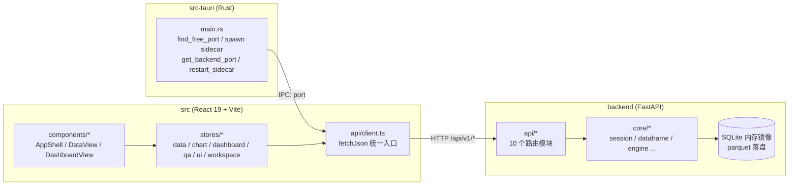
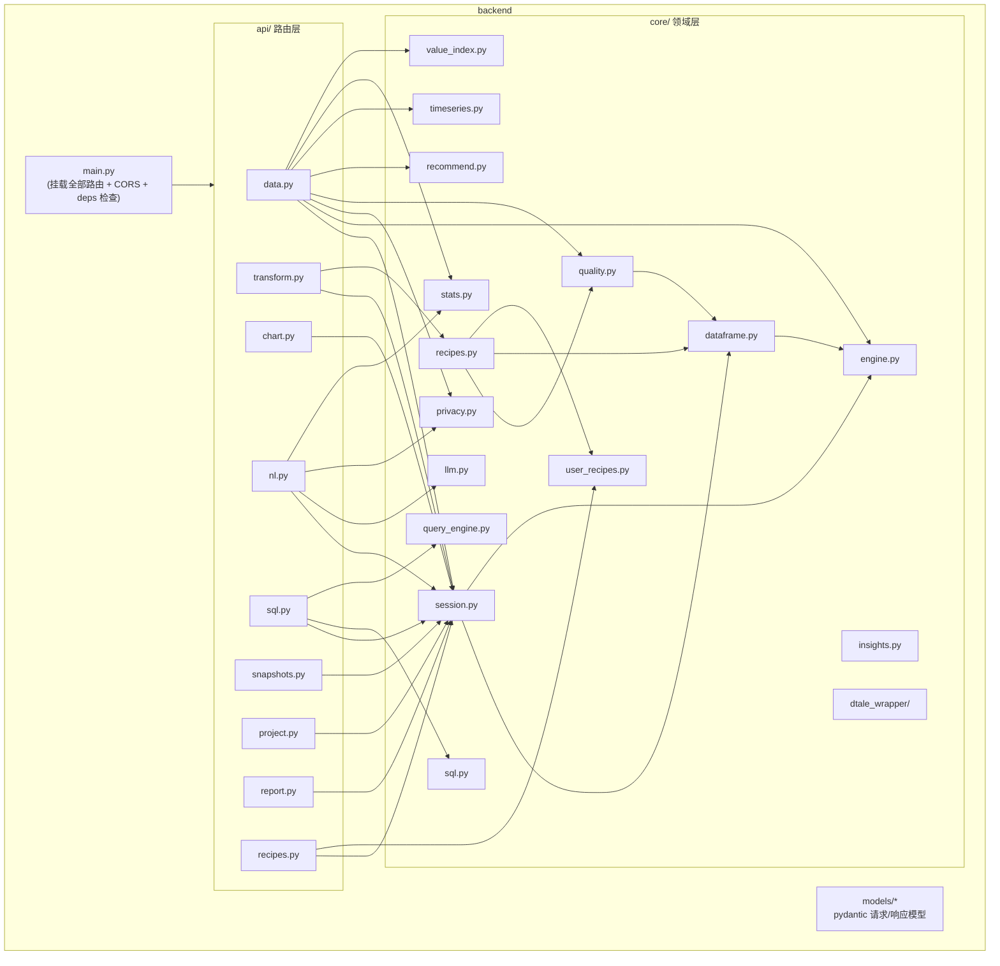

# MetricStudio 代码图谱

> 本图谱基于 [CodeGraph](https://codegraph.dev) 索引生成并人工校对（165 个源文件：Python 67 / TSX 51 / TS 34 / JS 6 / Rust 2）。
> 代码变更后运行 `codegraph sync`，即可用 `explore / callers / callees / impact / affected` 命令实时查询。

## 目录

- [架构总览](#架构总览)
- [模块依赖图](#模块依赖图)
- [核心调用链](#核心调用链)
- [后端模块](#后端模块)
- [前端模块](#前端模块)
- [代码枢纽（高影响面）](#代码枢纽高影响面)
- [持久化布局](#持久化布局)

## 架构总览

三层桌面应用：**Tauri 壳（Rust）** 管理窗口与 Python sidecar 生命周期；**React 前端** 负责全部交互与 Plotly 渲染；**FastAPI 后端** 持有数据会话、执行变换/统计/AI 前处理。前后端经 HTTP 通信（生产模式端口由 Rust 经 IPC 注入）。



## 模块依赖图



## 核心调用链

### 1. 启动与恢复

```
pnpm dev → scripts/start-dev.js
  ├→ Vite (0.0.0.0:5173)
  └→ scripts/start-backend.js → uvicorn backend.main:app
       └─ lifespan: SessionManager.restore()
            读 ~/.metricstudio/session/*.json + *.parquet
            → Dataset(raw_df) → _replay(history) 重建派生态
生产模式：src-tauri/main.rs find_free_port → spawn python-sidecar
  → 前端 initBackendPort() 经 IPC get_backend_port 注入端口
  → useBackend 断线时调 restart_sidecar 自愈
```

### 2. 数据生命周期（导入 → 变换 → 预览）

```
api/data.py (import / import-path / import-text / sample)
  → SessionManager.import_file()
      保留源文件副本 (SOURCES_DIR) → DataEngine.read_* → auto_engine
      → Dataset(raw_df + _df + history) → _persist (parquet + json)
api/transform.py → _apply_operations → Dataset.apply(op)
  → history.append → global_history (undo/redo) → _persist
GET /data/{id}/preview → Dataset.preview (过滤/排序/搜索/分页)
  → DataEngine.to_preview_rows → 前端 useVirtualizer 渲染
刷新：dataStore.autoRefreshChangedSources → refresh_dataset
  → 重读源文件 + 重放 history（步骤级 disabled 标记被跳过）
```

### 3. 图表管线

```
前端 ChartCanvas / DashboardChartCard → api.previewChart(datasetId, encoding, filters, brushes)
→ api/chart.py: _filter_by_filters (Dashboard 筛选 + 其他卡片框选)
→ _aggregate(encoding): 按 chart_type 构建 Plotly trace（20+ 类型）
→ 前端 PlotlyRenderer + applyPlotlyUserStyle
框选联动：PlotlyRenderer.onSelected → setBrushSelection → 兄弟卡片重取
```

### 4. AI 问答（含工具调用）

```
AskPanel / AICommandBar → api.nlAsk(datasetId, question, history, {snapshotId, filters})
→ api/nl.py:
  1. _ask_dataframe：快照归属校验 → _filter_by_filters
  2. _route_and_run_tools：短路由调用让 LLM 选工具
     (row_count / column_stats / distinct_count) → 确定性执行
  3. _build_data_context：概览行 + 列类型 + count/missing + 样本 + 洞察
     (privacy.prepare_for_llm 按配置脱敏/排除敏感列)
  4. 主 prompt = 上下文 + Computed facts + 压缩历史(8轮) + 问题 → chat()
  5. _build_data_evidence：schema/overview/statistics/sample/insight/tool 确定性证据
```

### 5. SQL 工作台

```
SqlWorkbench → POST /sql/workbench/query
→ query_engine.execute_query:
  校验单条只读 SELECT（黑名单关键词 + 禁多语句）
  → 会话全部数据集镜像进内存 SQLite
  → progress_handler 10s 超时 → fetchmany(10001)
  → EXPLAIN QUERY PLAN
→ 历史环形缓冲(50)；POST /import-result 把最近结果注册为新 Dataset
```

### 6. 报告与故事

```
ReportDialog / DashboardView Export → POST /report/generate
  charts(figures) + kpis + text_cards + filter_descriptions → 章节 HTML
StoryDialog → POST /report/story
  数据来源 → 清洗步骤(transform history) → 图表 → 洞察 → 手写结论
  → 章节化自包含 HTML（Plotly 交互保留）
```

## 后端模块

| 模块 | 职责 | 关键符号 |
|---|---|---|
| `main.py` | 应用装配：9 个路由、CORS 通配、`/api/v1/system/deps` 依赖体检 | `app`, `dependency_check` |
| `api/data.py` | 导入（文件/路径/粘贴/SQLite/sample）、预览分页、distinct 值搜索、聚合、质量、相关性/回归/差异检验/CI、时间序列 | `import_file`, `distinct_values`, `difference_test_endpoint` |
| `api/transform.py` | 16 类变换端点、batch、undo、步骤启用/禁用、质量修复预览、历史 | `set_step_disabled`, `quality_fix_preview` |
| `api/chart.py` | 图表 figure 构建（20+ 类型）、筛选/框选应用、图表推荐 | `_aggregate`, `_filter_by_filters` |
| `api/nl.py` | NL 清洗、问答（工具调用+隐私+证据）、narrate、explain-chart、LLM 配置 | `nl_ask`, `_route_and_run_tools` |
| `api/sql.py` | SQLite 上传/浏览/导入 + 工作台（schema/query/history/import-result） | `workbench_query`, `import_workbench_result` |
| `api/snapshots.py` | 快照创建/列表/预览/diff/恢复/删除 | `create_snapshot` |
| `api/project.py` | `.metricstudio` 打包与加载（zip：manifest+parquet+transforms）、HTML/PNG 导出 | `save_project`, `load_project` |
| `api/report.py` | 报告与分析故事的自包含 HTML 生成 | `generate_report`, `generate_story` |
| `api/recipes.py` | 预设/用户配方应用端点 | — |
| `core/session.py` | **会话中枢**：数据集注册表、持久化/恢复、快照、全局撤销、刷新重放、lineage | `SessionManager`, `restore`, `df_at_step` |
| `core/dataframe.py` | `Dataset`（raw/derived/history）+ 16 类 `apply_*` 算子 | `Dataset.apply`, `preview` |
| `core/engine.py` | pandas/polars 双引擎：读写、类型推断、引擎自选（≥100 万行用 polars） | `DataEngine.auto_engine`, `infer_dtype_category` |
| `core/privacy.py` | 敏感列识别 + 三种数据范围策略（all/redact/exclude） | `prepare_for_llm`, `sensitive_columns` |
| `core/quality.py` | 质量检测（缺失/重复/异常/常量/数字串/格式）+ 列统计 + 样本行 | `detect_quality`, `column_stats` |
| `core/recipes.py` | 预设清洗配方与安全修复计划 | `build_quality_fix_plan` |
| `core/insights.py` | 规则式洞察生成（趋势/集中度/偏度/相关性/缺失） | `generate_insights` |
| `core/timeseries.py` | 月度聚合、MoM/YoY、移动平均、2σ 异常、趋势外推 | `analyze_timeseries` |
| `core/stats.py` | 相关矩阵、OLS 回归、Welch/配对/Mann-Whitney、置信区间 | `correlation_matrix`, `linear_regression`, `difference_test` |
| `core/value_index.py` | 列值 LRU 缓存（链长+帧指针失效令牌） | `sorted_unique_values` |
| `core/query_engine.py` | SQL 工作台执行器：校验/镜像/超时/计划/历史 | `execute_query`, `QueryHistory` |
| `core/recommend.py` | 规则式图表推荐 | `recommend_charts` |
| `core/llm.py` | OpenAI 兼容 chat 封装；配置落盘 0600 | `chat`, `load_config` |
| `core/sql.py` | SQLite 表清单/读取 | `read_table` |
| `core/user_recipes.py` | 用户自定义配方存储 | `get_user_recipe` |
| `dtale_wrapper/` | dtale 3.x describe 适配（缺失回退 pandas） | `describe_dataframe` |
| `models/` | 请求/响应 pydantic 模型（camelCase 别名） | `DataFrameMeta`, `FilterSpec` |

## 前端模块

| 模块 | 职责 |
|---|---|
| `api/client.ts` | 全部后端调用的类型化封装；端口发现、统一错误 |
| `stores/dataStore.ts` | 数据集列表/活跃集/预览/源状态/自动刷新/版本号 |
| `stores/chartStore.ts` | 图表 CRUD、编码更新、重命名、复制 |
| `stores/dashboardStore.ts` | 多 Dashboard、筛选、布局模板、编辑模式、锁定、复制、对齐等距、undo/redo |
| `stores/qaStore.ts` | 问答会话、快照/筛选绑定、turn 增删改 |
| `stores/uiStore.ts` | 弹窗/通知/语言/快捷键/报告草稿/自动保存目标/AI 栏开关 |
| `stores/workspaceStore.ts` | 工作区标签页、面板折叠状态 |
| `components/layout/*` | TitleBar（含 Tooltip）、AppShell、WorkspaceLayout（可拖拽侧栏 + autoSaveId）、StatusBar（AI 栏开关）、CenterArea |
| `components/data/*` | DataTable（虚拟行+冻结表头）、DataView 视图切换、SqlWorkbench、LineageView（链步骤开关）、SnapshotView、CleaningPanel、StatsPanel、InsightsPanel（时间序列工作台）、AskPanel、TransformPanel、DatasetList |
| `components/dashboard/*` | DashboardView（编辑/查看模式）、DashboardChartCard（联动）、DashboardFilterBar（高基数搜索）、KpiCard、TextCard |
| `components/chart/*` | ChartCanvas、EncodingPanel、PropertyEditor、PlotlyRenderer（框选回调） |
| `components/common/*` | ReportDialog、StoryDialog、SettingsDialog（隐私/模型）、CommandPalette、ShortcutsPanel、BackendBanner |
| `components/ai/AICommandBar.tsx` | 底部胶囊：NL 清洗 + 问答（滑入滑出动效） |
| `utils/autoSave.ts` | 空闲检测 + 2 分钟静默自动保存 |
| `utils/qaContext.ts` / `qaExport.ts` | 问答筛选上下文、Markdown/HTML 导出 |
| `utils/globalHistory.ts` | 全局撤销/重做前端入口 |
| `i18n/` | zh / en 全量文案 |

## 代码枢纽（高影响面）

> 数据来自 `codegraph impact` / `callers`，修改下列符号前务必运行影响分析并回归测试。

| 符号 | 位置 | 影响面 |
|---|---|---|
| `session`（SessionManager 单例） | core/session.py | **12 个模块调用**；数据生命周期唯一入口 |
| `detect_quality` | core/quality.py | 10 个调用方（data API、recipes）；质检与修复计划共享 |
| `recommend_charts` | core/recommend.py | 9 个调用方；依赖 `infer_dtype_category` |
| `DataEngine` | core/engine.py | 8 个调用方；所有 IO 与类型推断的底座 |
| `auto_engine` | core/engine.py | 4 个调用方（导入/SQL/快照恢复路径） |
| `_filter_by_filters` | api/chart.py | 图表、问答、KPI 聚合共用筛选语义 |
| `chat` | core/llm.py | 全部 AI 端点的唯一出口（可在此统一埋点/重试） |

## 持久化布局

| 位置 | 内容 |
|---|---|
| `~/.metricstudio/session/` | 数据集原始数据（parquet）+ 元数据/变换链（json），重启恢复 |
| `~/.metricstudio/sources/` | 导入源文件副本（供刷新重读） |
| `~/.metricstudio/snapshots/` | 不可变快照 parquet |
| `~/.metricstudio/projects/` | 上传的项目包暂存 |
| `~/.metricstudio/llm-config.json` | LLM 端点/模型/API Key（0600） |
| localStorage | Dashboard 布局、面板宽度、语言、快捷键、报告模板、UI 偏好 |
