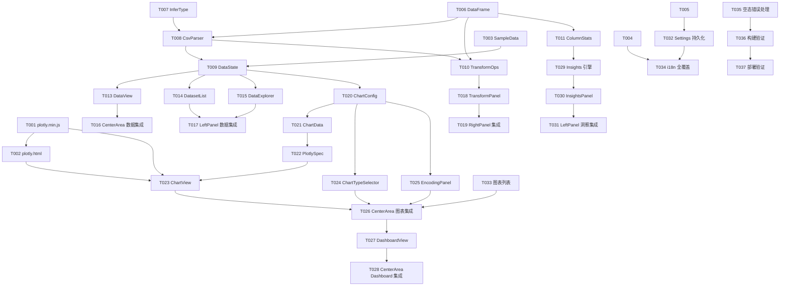

# Tasks: MetricStudio 鸿蒙全量移植（基于 main 分支）

**Input**: Design documents from `spec/harmonyos-port/`
**Prerequisites**: plan.md (required), spec.md (required for user stories)

**Tests**: 未显式要求 TDD，仅引擎纯逻辑（CsvParser/TransformOps）用 devecocli build 静态校验 + 运行期验证。

**Organization**: Tasks are grouped by user story to enable independent implementation and testing of each story.

## Format: `[ID] [P?] [Story] Description`

- **[P]**: Can run in parallel (different files, no dependencies)
- **[Story]**: Which user story this task belongs to (e.g., US1, US2, US3)
- Include exact file paths in descriptions

## Path Conventions

- 单模块工程，路径前缀 `entry/src/main/`；引擎 `ets/engine/`，模型 `ets/model/`，视图 `ets/views/`，通用 `ets/common/`，资源 `resources/base/rawfile/`

---

## Phase 1: Setup (共享基础设施)

**Purpose**: 图表渲染宿主资源、示例数据、i18n/主题基础

- [X] T001 从 main 分支提取 plotly.min.js 到 `entry/src/main/resources/base/rawfile/plotly.min.js`（git show main:public/plotly.min.js）
- [X] T002 创建 Plotly 宿主页 `entry/src/main/resources/base/rawfile/plotly.html`（dark 背景 #0d0d0d，暴露 window.renderFigure(jsonStr)，Plotly.react 渲染）
- [X] T003 创建内置示例数据 `entry/src/main/ets/engine/SampleData.ets`（对齐 main 分支 sample_data.csv 的 128 行数据，含日期/类别/数值/区域列）
- [X] T004 扩展 i18n 字典 `entry/src/main/ets/common/Locale.ets`（zh/en 双语文案表，覆盖壳+数据+图表+Dashboard+洞察的 key）
- [X] T005 扩展主题 `entry/src/main/ets/common/Theme.ets`（增加 light 模式令牌，对齐 main index.css .light 值）

---

## Phase 2: Foundational (阻塞性前置)

**Purpose**: 数据引擎核心——无此阶段任何 user story 无法实现

**⚠️ CRITICAL**: 本阶段未完成前不得开始任何 user story

- [X] T006 移植 DataFrame 数据模型 `entry/src/main/ets/model/DataFrame.ets`（ColumnMeta/DataFrame/CellValue，含 rowCount/colCount，对齐 Web types/data.ts）
- [X] T007 移植类型推断 `entry/src/main/ets/engine/InferType.ets`（inferColumnDtype: number/date/string → quantitative/nominal/temporal）
- [X] T008 移植 CSV 解析 `entry/src/main/ets/engine/CsvParser.ets`（RFC4180：引号/转义/换行/空值，首行表头，每列推断类型）
- [X] T009 创建数据状态 `entry/src/main/ets/model/DataState.ets`（@Observed：dataFrames/activeIndex/previewRows/transformHistory；importCsvText/applyTransform/undo）
- [X] T010 移植变换引擎 `entry/src/main/ets/engine/TransformOps.ets`（dedupe/fillMissing/convertType/sort/filter/rename/aggregate/compute/dropCol，语义对齐 Web backend transforms）
- [X] T011 移植列统计 `entry/src/main/ets/engine/ColumnStats.ets`（min/max/mean/uniqueCount/missingCount，供洞察与属性面板）
- [X] T012 创建格式化工具 `entry/src/main/ets/common/Format.ets`（fmt 数值千分位/日期，对齐 Web utils/format.ts）

**Checkpoint**: 数据引擎就绪——可开始各 user story

---

## Phase 3: User Story 1 - 导入数据并查看表格（P1）🎯 MVP

**Goal**: CSV 导入（文件/粘贴/示例）→ 表格渲染（列类型徽章/排序/分页）+ 数据集列表
**Independent Test**: 启动 → 点"开始示例" → 数据视图表格渲染 128 行 × 5 列，列类型正确

- [X] T013 [US1] 创建数据表格视图 `entry/src/main/ets/views/DataView.ets`（表头列名+类型徽章+排序，表格体分页渲染 ≤100 行/页，行数/列数信息）
- [X] T014 [US1] 创建数据集列表 `entry/src/main/ets/views/DatasetList.ets`（多数据集：激活高亮/行数徽章/删除/切换）
- [X] T015 [US1] 创建数据导入器 `entry/src/main/ets/views/DataExplorer.ets`（DocumentViewPicker 选 CSV + 文本粘贴 TextArea + 示例数据按钮，调 DataState.importCsvText）
- [X] T016 [US1] 集成数据视图到主区域 `entry/src/main/ets/views/CenterArea.ets`（有数据时渲染标签栏[数据/Dashboard/图表]+数据视图，空态改为真实欢迎向导）
- [X] T017 [US1] 集成数据集列表与导入器到左侧栏 `entry/src/main/ets/views/LeftPanel.ets`（探索器 section 放 DataExplorer，数据集 section 放 DatasetList，替换占位）

**Checkpoint**: US1 独立可用——导入→表格→切换数据集

---

## Phase 4: User Story 2 - 变换算子（P2）

**Goal**: 清洗/排序/筛选/聚合变换面板 + 撤销
**Independent Test**: 对示例数据执行分组聚合 → 表格更新为聚合结果；撤销恢复

- [X] T018 [US2] 创建变换面板 `entry/src/main/ets/views/TransformPanel.ets`（算子选择：去重/填缺失/类型转换/排序/筛选/重命名/分组聚合/计算列，参数表单，执行/撤销按钮，调 DataState.applyTransform/undo）
- [X] T019 [US2] 集成变换面板到右侧栏 `entry/src/main/ets/views/RightPanel.ets`（替换占位内容，属性编辑器 section 保留占位）

**Checkpoint**: US2 独立可用——变换→表格联动→撤销

---

## Phase 5: User Story 3 - 构建并渲染图表（P2）

**Goal**: 图表标签页 + 33 型选择 + 编码面板 + WebView/Plotly 画布
**Independent Test**: 新建折线图，X=日期、Y=数值 sum → 画布渲染折线

- [X] T020 [P] [US3] 移植图表配置模型 `entry/src/main/ets/model/ChartConfig.ets`（ChartType 33 型联合/EncodingChannel/YFieldConfig/ChartEncoding/ChartConfig，对齐 Web types/encoding.ts）
- [X] T021 [P] [US3] 移植图表数据准备 `entry/src/main/ets/engine/ChartData.ets`（buildChartData：按编码聚合/分组/排序，输出 ChartDataset）
- [X] T022 [P] [US3] 移植 Plotly figure 构造 `entry/src/main/ets/engine/PlotlySpec.ets`（figureFromChartData：type/layout/trace 构造，对齐 Web utils/encodingToPlotly.ts + plotlyLayout.ts）
- [X] T023 [US3] 创建图表画布 `entry/src/main/ets/views/ChartView.ets`（Web 组件 src=$rawfile('plotly.html') + WebviewController，onPageEnd 后 runJavaScript('renderFigure(...)')，编码变化实时刷新）
- [X] T024 [US3] 创建图表类型选择器 `entry/src/main/ets/views/ChartTypeSelector.ets`（33 型分类分组选择，对齐 Web ChartTypeSelector）
- [X] T025 [US3] 创建编码面板 `entry/src/main/ets/views/EncodingPanel.ets`（X/Y[可多]/颜色/聚合/选项，对齐 Web EncodingPanel，触发 DataState/ChartState 刷新）
- [X] T026 [US3] 集成图表标签页到主区域 `entry/src/main/ets/views/CenterArea.ets`（多图表 tab：新建+/关闭×/激活，数据/Dashboard/图表 tab 切换）

**Checkpoint**: US3 独立可用——新建图表→编码→WebView 渲染 33 型

---

## Phase 6: User Story 4 - Dashboard（P3）

**Goal**: 图表网格 + KPI 卡片 + 全局筛选联动
**Independent Test**: 创建 Dashboard 添加图表 → 网格渲染；KPI 卡片显示聚合值

- [X] T027 [US4] 创建 Dashboard 视图 `entry/src/main/ets/views/DashboardView.ets`（DashboardConfig 模型 + 图表项网格嵌入 ChartView + KPI 卡片（列聚合值）+ 文本卡片 + 简单布局，对齐 Web DashboardView/KpiCard）
- [X] T028 [US4] 集成 Dashboard 标签页到主区域 `entry/src/main/ets/views/CenterArea.ets`（Dashboard tab 渲染 DashboardView）

**Checkpoint**: US4 独立可用——Dashboard 网格 + KPI

---

## Phase 7: User Story 5 - 洞察与质量报告（P3）

**Goal**: 本地统计洞察 + 质量报告 + 清洗建议
**Independent Test**: 打开洞察面板 → 显示缺失值/分布/趋势洞察

- [X] T029 [P] [US5] 创建洞察引擎 `entry/src/main/ets/engine/Insights.ets`（computeInsights：缺失/离群/趋势/分布；computeQualityReport：缺失单元格数/重复行/类型建议，纯逻辑）
- [X] T030 [US5] 创建洞察面板 `entry/src/main/ets/views/InsightsPanel.ets`（洞察列表 + 质量报告卡片，severity 着色 info/warning，对齐 Web InsightsPanel/QualityReport）
- [X] T031 [US5] 集成洞察面板到左侧栏 `entry/src/main/ets/views/LeftPanel.ets`（新增"洞察"入口/区域，替换占位）

**Checkpoint**: US5 独立可用——洞察与质量报告展示

---

## Phase 8: Polish & Cross-Cutting Concerns

**Purpose**: 跨模块完善

- [X] T032 语言/主题持久化 `entry/src/main/ets/common/Settings.ets`（@kit.ArkData Preferences 读写 language/theme，启动时加载，状态栏切换时保存）
- [X] T033 左侧栏图表列表 section（替换占位：已建图表列表，点击切换图表 tab，对齐 Web ChartsSection）
- [X] T034 i18n 全覆盖检查 `entry/src/main/ets/common/Locale.ets`（所有硬编码文案迁移到字典，zh/en 对称，语言切换全局生效）
- [X] T035 空态/错误处理完善（空数据集提示、CSV 解析错误 Toast、非数值聚合报错回退）

---

## Phase 9: Verification

<!-- verification_scope: build-only -->

**Purpose**: 构建与部署验证（不含 UI 验证）

- [ ] T036 构建项目并修复所有编译错误（运行 `devecocli build`，迭代修复直至成功）
- [ ] T037 部署应用到设备（`devecocli run --skip-build`；设备自连失败时用 hdc 安装链路：file send + bm install + aa start）

---

## 📊 Dependency Graph



## ⚡ Parallel Execution Guide

| Phase | Tasks | Required Files | Execution Notes |
|---|---|---|---|
| Setup | T001, T003, T004, T005 | rawfile/, SampleData.ets, Locale.ets, Theme.ets | T001→T002 串行，其余并行 |
| Foundational | T006, T007, T011, T012 | 引擎/模型文件 | 可并行（T007→T008→T009 串行链路） |
| US1 | T013, T014, T015 | views/DataView, DatasetList, DataExplorer | 三个视图可并行，之后 T016/T017 集成 |
| US2 | T018 | views/TransformPanel | 依赖 T010 |
| US3 | T020, T021, T022 | 模型+引擎 | 并行；之后 T023-T025 并行；最后 T026 集成 |
| US4 | T027 | views/DashboardView | 依赖 US3 完成（嵌入 ChartView） |
| US5 | T029, T030 | 引擎+面板 | 并行；T031 集成 |
| Polish | T032, T033, T035 | 通用/视图 | 可并行 |
| Verification | T036, T037 | — | 串行 |

## 实施策略

### MVP 优先（US1 单独交付）

1. Setup（T001-T005）→ Foundational（T006-T012）
2. US1（T013-T017）→ 独立验证：导入→表格
3. 部署演示

### 增量交付

1. Setup + Foundational → 引擎就绪
2. US1 → 独立验证（MVP：导入+表格）
3. US2 → 独立验证（变换+撤销）
4. US3 → 独立验证（图表 WebView 渲染）
5. US4 → Dashboard → US5 → 洞察
6. Polish → Verification（build-only）

## Notes

- [P] 任务 = 不同文件、无依赖
- [Story] 标签映射 spec.md 用户故事（US1-US5）
- 每完成一个逻辑任务组即 commit
- 引擎代码优先复用 harmonyos-port-old-backup 分支已验证实现
- 图表渲染必须走 WebView+Plotly（用户指定），不得用 @ohos/charts
- 每个 Checkpoint 可独立验证故事

---

## Dependencies & Execution Order

### Phase Dependencies

- **Setup (Phase 1)**: 无依赖，可立即开始（T001→T002 串行，其余并行）
- **Foundational (Phase 2)**: 依赖 Setup；BLOCKS 所有 user stories
- **US1 (Phase 3, P1)**: 依赖 Foundational 完成
- **US2 (Phase 4, P2)**: 依赖 Foundational（T010 TransformOps）
- **US3 (Phase 5, P2)**: 依赖 Foundational + US1 数据链路（图表需要数据集）
- **US4 (Phase 6, P3)**: 依赖 US3（DashboardView 嵌入 ChartView）
- **US5 (Phase 7, P3)**: 依赖 Foundational（ColumnStats）
- **Polish (Phase 8)**: 依赖所有 user stories 完成
- **Verification (Phase 9)**: 依赖全部实现任务完成

### User Story Dependencies

- **US1 (P1)**: Foundational 后即可开始，无其他故事依赖（MVP）
- **US2 (P2)**: Foundational 后即可开始；数据来自 US1 链路
- **US3 (P2)**: Foundational 后即可开始；渲染需要 US1 的数据集
- **US4 (P3)**: 依赖 US3 图表组件
- **US5 (P3)**: 仅依赖 Foundational 引擎

### Within Each User Story

- 引擎/模型（纯逻辑）→ 视图（渲染）→ 集成（CenterArea/LeftPanel/RightPanel）
- 故事完成并独立验证后再进入下一优先级

### Parallel Opportunities

- Setup 中 T003/T004/T005 并行；T001→T002 串行
- Foundational 中 T006/T007/T011/T012 并行（T007→T008→T009→T010 链路串行）
- US1 中 T013/T014/T015 并行，T016/T017 集成在其后
- US3 中 T020/T021/T022 并行，T023/T024/T025 并行，T026 最后集成
- US5 中 T029/T030 并行，T031 集成
- Polish 中 T032/T033/T035 并行

---

## Parallel Example: User Story 3

```bash
# 并行：图表模型 + 数据准备 + figure 构造（不同文件，无依赖）
Task: "T020 [US3] 移植图表配置模型 entry/src/main/ets/model/ChartConfig.ets"
Task: "T021 [US3] 移植图表数据准备 entry/src/main/ets/engine/ChartData.ets"
Task: "T022 [US3] 移植 Plotly figure 构造 entry/src/main/ets/engine/PlotlySpec.ets"

# 并行：WebView 画布 + 类型选择器 + 编码面板（依赖 T020-T022 完成）
Task: "T023 [US3] 创建图表画布 entry/src/main/ets/views/ChartView.ets"
Task: "T024 [US3] 创建图表类型选择器 entry/src/main/ets/views/ChartTypeSelector.ets"
Task: "T025 [US3] 创建编码面板 entry/src/main/ets/views/EncodingPanel.ets"

# 最后集成（依赖 T023-T025）
Task: "T026 [US3] 集成图表标签页 entry/src/main/ets/views/CenterArea.ets"
```
